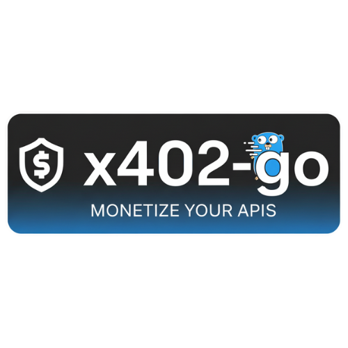

<p align="center">
  
</p>

# x402-go

Go implementation of the x402 payment standard for paywalled HTTP endpoints.

## Overview

x402-go makes it simple to add crypto payments to HTTP APIs. This library provides:

- **USDC helpers** for easy payment setup across 8+ chains (Base, Polygon, Avalanche, Solana, Ethereum)
- **Middleware** for standard `net/http`, Chi, Gin, and PocketBase frameworks
- **HTTP client** with automatic payment handling
- **Multi-chain support** with automatic wallet selection
- **MCP (Model Context Protocol)** integration for AI tool payments
- **Multiple signer options**: Local wallets (EVM, Solana) or managed wallets (Coinbase CDP)

## Quick Start

### Server: Accept USDC Payments

Use the USDC helpers to create payment requirements in just a few lines:

```go
import (
    "net/http"
    "github.com/mark3labs/x402-go"
    x402http "github.com/mark3labs/x402-go/http"
)

func main() {
    // Create payment requirement using USDC helper
    requirement, _ := x402.NewUSDCPaymentRequirement(x402.USDCRequirementConfig{
        Chain:            x402.BaseMainnet,
        Amount:           "0.01",           // Human-readable USDC amount
        RecipientAddress: "0xYourAddress",
    })

    // Configure middleware
    config := &x402http.Config{
        FacilitatorURL: "https://facilitator.x402.rs",
        PaymentRequirements: []x402.PaymentRequirement{requirement},
    }

    // Protect your endpoint
    middleware := x402http.NewX402Middleware(config)
    http.Handle("/data", middleware(yourHandler))
    http.ListenAndServe(":8080", nil)
}
```

That's it! The helper automatically:
- Converts "0.01" to atomic units (10000)
- Sets the correct USDC contract address
- Configures EIP-3009 domain parameters
- Applies sensible defaults

### Client: Pay for API Access

```go
import (
    "github.com/mark3labs/x402-go"
    "github.com/mark3labs/x402-go/signers/evm"
    x402http "github.com/mark3labs/x402-go/http"
)

// Create USDC token config using helper
token := x402.NewUSDCTokenConfig(x402.BaseMainnet, 1)

// Create signer with your wallet
signer, _ := evm.NewSigner(
    evm.WithPrivateKey("0xYourKey"),
    evm.WithNetwork("base"),
    evm.WithToken(token.Address, token.Symbol, token.Decimals),
)

// Create client - payments happen automatically
client, _ := x402http.NewClient(x402http.WithSigner(signer))
resp, _ := client.Get("https://api.example.com/data")
```

## USDC Chain Support

The library includes pre-configured USDC constants for these chains:

| Chain | Mainnet Constant | Testnet Constant |
|-------|-----------------|------------------|
| Base | `BaseMainnet` | `BaseSepolia` |
| Polygon | `PolygonMainnet` | `PolygonAmoy` |
| Avalanche | `AvalancheMainnet` | `AvalancheFuji` |
| Solana | `SolanaMainnet` | `SolanaDevnet` |

All USDC addresses are verified and include EIP-3009 parameters for EVM chains.

**Additional supported networks** (for custom token configurations):
- Ethereum Mainnet (`ethereum`)
- Ethereum Sepolia (`sepolia`)

## Server Examples

### Accept Multiple Chains

Let clients pay with USDC on any supported chain:

```go
requirements := []x402.PaymentRequirement{}

// Accept Base USDC
baseReq, _ := x402.NewUSDCPaymentRequirement(x402.USDCRequirementConfig{
    Chain:            x402.BaseMainnet,
    Amount:           "0.50",
    RecipientAddress: "0xYourAddress",
})
requirements = append(requirements, baseReq)

// Or Polygon USDC
polygonReq, _ := x402.NewUSDCPaymentRequirement(x402.USDCRequirementConfig{
    Chain:            x402.PolygonMainnet,
    Amount:           "0.50",
    RecipientAddress: "0xYourAddress",
})
requirements = append(requirements, polygonReq)

// Or Solana USDC
solanaReq, _ := x402.NewUSDCPaymentRequirement(x402.USDCRequirementConfig{
    Chain:            x402.SolanaMainnet,
    Amount:           "0.50",
    RecipientAddress: "YourSolanaAddress",
})
requirements = append(requirements, solanaReq)

config := &x402http.Config{
    FacilitatorURL: "https://facilitator.x402.rs",
    PaymentRequirements: requirements,
}
```

### Using with Gin Framework

```go
import (
    "github.com/gin-gonic/gin"
    "github.com/mark3labs/x402-go"
    ginx402 "github.com/mark3labs/x402-go/http/gin"
)

func main() {
    // Create payment requirement
    requirement, _ := x402.NewUSDCPaymentRequirement(x402.USDCRequirementConfig{
        Chain:            x402.BaseSepolia,
        Amount:           "0.01",
        RecipientAddress: "0xYourAddress",
    })

    config := &x402http.Config{
        FacilitatorURL: "https://facilitator.x402.rs",
        PaymentRequirements: []x402.PaymentRequirement{requirement},
    }

    // Setup Gin with x402 middleware
    r := gin.Default()
    r.Use(ginx402.NewGinX402Middleware(config))

    r.GET("/data", func(c *gin.Context) {
        // Access payment details from context
        if payment, exists := c.Get("x402_payment"); exists {
            verifyResp := payment.(*x402http.VerifyResponse)
            c.JSON(200, gin.H{
                "data": "your response",
                "payer": verifyResp.Payer,
            })
            return
        }
        c.JSON(402, gin.H{"error": "payment required"})
    })

    r.Run(":8080")
}
```

See `examples/gin/` for complete examples.

### Using with Chi Framework

Chi uses the standard `http.Handler` middleware interface, so you can use the base middleware directly:

```go
import (
    "net/http"
    "github.com/go-chi/chi/v5"
    "github.com/mark3labs/x402-go"
    x402http "github.com/mark3labs/x402-go/http"
)

func main() {
    // Create payment requirement
    requirement, _ := x402.NewUSDCPaymentRequirement(x402.USDCRequirementConfig{
        Chain:            x402.BaseSepolia,
        Amount:           "0.01",
        RecipientAddress: "0xYourAddress",
    })

    config := &x402http.Config{
        FacilitatorURL: "https://facilitator.x402.rs",
        PaymentRequirements: []x402.PaymentRequirement{requirement},
    }

    // Setup Chi with x402 middleware (uses standard http.Handler interface)
    r := chi.NewRouter()
    r.Use(x402http.NewX402Middleware(config))

    r.Get("/data", func(w http.ResponseWriter, r *http.Request) {
        // Access payment details from context
        if payment := r.Context().Value(x402http.PaymentContextKey); payment != nil {
            verifyResp := payment.(*x402http.VerifyResponse)
            w.Header().Set("Content-Type", "application/json")
            w.Write([]byte(`{"data": "your response", "payer": "` + verifyResp.Payer + `"}`))
            return
        }
        w.WriteHeader(http.StatusPaymentRequired)
        w.Write([]byte(`{"error": "payment required"}`))
    })

    http.ListenAndServe(":8080", r)
}
```

See `examples/chi/` for complete examples.

### Using with PocketBase Framework

```go
import (
    "github.com/pocketbase/pocketbase"
    "github.com/pocketbase/pocketbase/core"
    "github.com/mark3labs/x402-go"
    x402http "github.com/mark3labs/x402-go/http"
    pbx402 "github.com/mark3labs/x402-go/http/pocketbase"
)

func main() {
    app := pocketbase.New()

    // Create payment requirement
    requirement, _ := x402.NewUSDCPaymentRequirement(x402.USDCRequirementConfig{
        Chain:            x402.BaseSepolia,
        Amount:           "0.01",
        RecipientAddress: "0xYourAddress",
    })

    config := &x402http.Config{
        FacilitatorURL: "https://facilitator.x402.rs",
        PaymentRequirements: []x402.PaymentRequirement{requirement},
    }

    // Apply middleware to specific routes
    app.OnRecordBeforeCreateRequest("protected_collection").BindFunc(func(e *core.RequestEvent) error {
        middleware := pbx402.NewPocketBaseX402Middleware(config)
        return middleware(e)
    })

    app.Start()
}
```

See `examples/pocketbase/` for complete examples.

### Custom Configuration

Override defaults for specific use cases:

```go
requirement, _ := x402.NewUSDCPaymentRequirement(x402.USDCRequirementConfig{
    Chain:             x402.BaseMainnet,
    Amount:            "2.50",
    RecipientAddress:  "0xYourAddress",
    Scheme:            "estimate",        // Default: "exact"
    MaxTimeoutSeconds: 600,               // Default: 300
    MimeType:          "application/xml", // Default: "application/json"
})
```

## Client Examples

### Single Chain Client (EVM)

```go
import (
    "github.com/mark3labs/x402-go"
    "github.com/mark3labs/x402-go/signers/evm"
    x402http "github.com/mark3labs/x402-go/http"
)

// Use USDC helper for token config
token := x402.NewUSDCTokenConfig(x402.BaseMainnet, 1)

// Option 1: From private key
signer, _ := evm.NewSigner(
    evm.WithPrivateKey("0xYourPrivateKey"),
    evm.WithNetwork("base"),
    evm.WithToken(token.Address, token.Symbol, token.Decimals),
)

// Option 2: From encrypted keystore
signer, _ := evm.NewSigner(
    evm.WithKeystore("/path/to/keystore.json", "password"),
    evm.WithNetwork("base"),
    evm.WithToken(token.Address, token.Symbol, token.Decimals),
)

// Option 3: From mnemonic
signer, _ := evm.NewSigner(
    evm.WithMnemonic("your twelve word mnemonic phrase...", "m/44'/60'/0'/0/0"),
    evm.WithNetwork("base"),
    evm.WithToken(token.Address, token.Symbol, token.Decimals),
)

client, _ := x402http.NewClient(x402http.WithSigner(signer))
resp, _ := client.Get("https://api.example.com/data")
```

### Multi-Chain Client

Configure multiple wallets and the client will automatically choose the best one:

```go
import (
    "github.com/mark3labs/x402-go"
    "github.com/mark3labs/x402-go/signers/evm"
    "github.com/mark3labs/x402-go/signers/svm"
    x402http "github.com/mark3labs/x402-go/http"
)

// Setup Base wallet
baseToken := x402.NewUSDCTokenConfig(x402.BaseMainnet, 1)  // Priority 1 (highest)
baseSigner, _ := evm.NewSigner(
    evm.WithPrivateKey("0xYourKey"),
    evm.WithNetwork("base"),
    evm.WithToken(baseToken.Address, baseToken.Symbol, baseToken.Decimals),
)

// Setup Solana wallet
solanaToken := x402.NewUSDCTokenConfig(x402.SolanaMainnet, 2)  // Priority 2
solanaSigner, _ := svm.NewSigner(
    svm.WithPrivateKey("YourSolanaKey"),
    svm.WithNetwork("solana"),
    svm.WithToken(solanaToken.Address, solanaToken.Symbol, solanaToken.Decimals),
)

// Client automatically selects appropriate wallet
client, _ := x402http.NewClient(
    x402http.WithSigner(baseSigner),
    x402http.WithSigner(solanaSigner),
)

// Works with any paywalled endpoint
resp, _ := client.Get("https://api.example.com/data")
```

### Solana Client

```go
import (
    "github.com/mark3labs/x402-go"
    "github.com/mark3labs/x402-go/signers/svm"
    x402http "github.com/mark3labs/x402-go/http"
)

// Use USDC helper for token config
token := x402.NewUSDCTokenConfig(x402.SolanaMainnet, 1)

// Option 1: From private key
signer, _ := svm.NewSigner(
    svm.WithPrivateKey("Base58PrivateKey"),
    svm.WithNetwork("solana"),
    svm.WithToken(token.Address, token.Symbol, token.Decimals),
)

// Option 2: Load from Solana CLI keygen file
signer, _ := svm.NewSigner(
    svm.WithKeygenFile("~/.config/solana/id.json"),
    svm.WithNetwork("solana"),
    svm.WithToken(token.Address, token.Symbol, token.Decimals),
)

client, _ := x402http.NewClient(x402http.WithSigner(signer))
resp, _ := client.Get("https://api.example.com/data")
```

### Coinbase CDP Wallets

Use Coinbase Developer Platform to manage wallets securely without storing private keys:

```go
import (
    "github.com/mark3labs/x402-go"
    "github.com/mark3labs/x402-go/signers/coinbase"
    x402http "github.com/mark3labs/x402-go/http"
)

// Create signer with CDP credentials
signer, _ := coinbase.NewSigner(
    coinbase.WithCDPCredentials("your-api-key-name", "your-private-key"),
    // Or load from environment: coinbase.WithCDPCredentialsFromEnv()
    coinbase.WithNetwork("base"),  // Supports both EVM and Solana networks
)

client, _ := x402http.NewClient(x402http.WithSigner(signer))
resp, _ := client.Get("https://api.example.com/data")
```

Benefits of CDP wallets:
- No local private key management
- Automatic wallet creation and recovery
- Supports both EVM and Solana networks
- Enterprise-grade security

See `examples/coinbase/` for complete setup instructions.

## MCP Integration

x402-go includes Model Context Protocol (MCP) support for protecting AI tools with payments.

### MCP Server: Protect AI Tools

```go
import (
    "github.com/mark3labs/x402-go"
    "github.com/mark3labs/x402-go/mcp/server"
)

func main() {
    // Create payment requirement
    requirement, _ := x402.NewUSDCPaymentRequirement(x402.USDCRequirementConfig{
        Chain:            x402.BaseSepolia,
        Amount:           "0.01",
        RecipientAddress: "0xYourAddress",
    })

    // Create MCP server
    s := server.NewX402Server("my-tools", "1.0.0", &server.Config{
        FacilitatorURL: "https://facilitator.x402.rs",
        PaymentRequirements: []x402.PaymentRequirement{requirement},
    })

    // Add free tools (no payment required)
    s.AddTool(server.Tool{
        Name:        "free_tool",
        Description: "A free tool",
        Handler:     freeToolHandler,
    })

    // Add paid tools (payment required)
    s.AddPayableTool(server.Tool{
        Name:        "premium_tool",
        Description: "A tool that requires payment",
        Handler:     premiumToolHandler,
    })

    // Start server
    s.Start(":8080")
}
```

### MCP Client: Auto-Pay for Tools

```go
import (
    "github.com/mark3labs/x402-go"
    "github.com/mark3labs/x402-go/signers/evm"
    x402http "github.com/mark3labs/x402-go/http"
    "github.com/mark3labs/x402-go/mcp/client"
)

// Setup signer
token := x402.NewUSDCTokenConfig(x402.BaseSepolia, 1)
signer, _ := evm.NewSigner(
    evm.WithPrivateKey("0xYourKey"),
    evm.WithNetwork("base-sepolia"),
    evm.WithToken(token.Address, token.Symbol, token.Decimals),
)

// Create HTTP client with automatic payments
httpClient, _ := x402http.NewClient(x402http.WithSigner(signer))

// Use with MCP client (payments handled automatically)
// Configure your MCP client to use this HTTP client
```

See `examples/mcp/` for complete MCP server and client examples.
